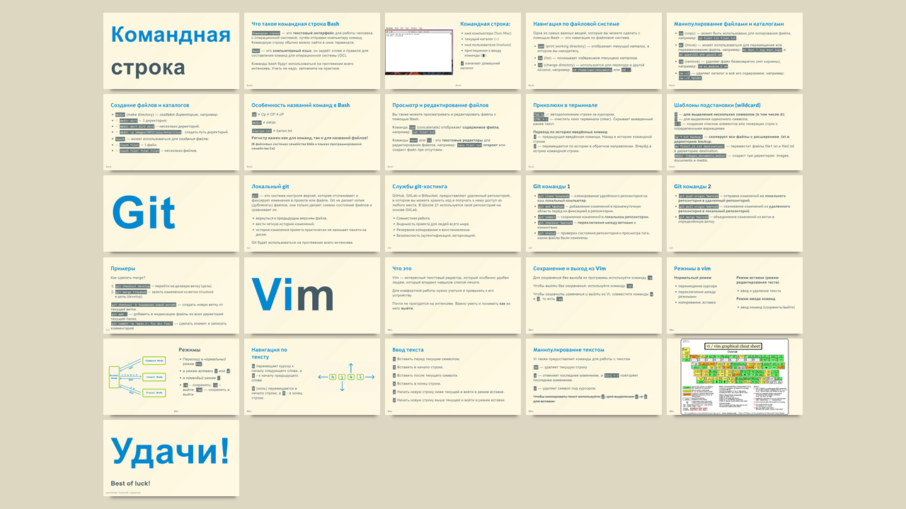
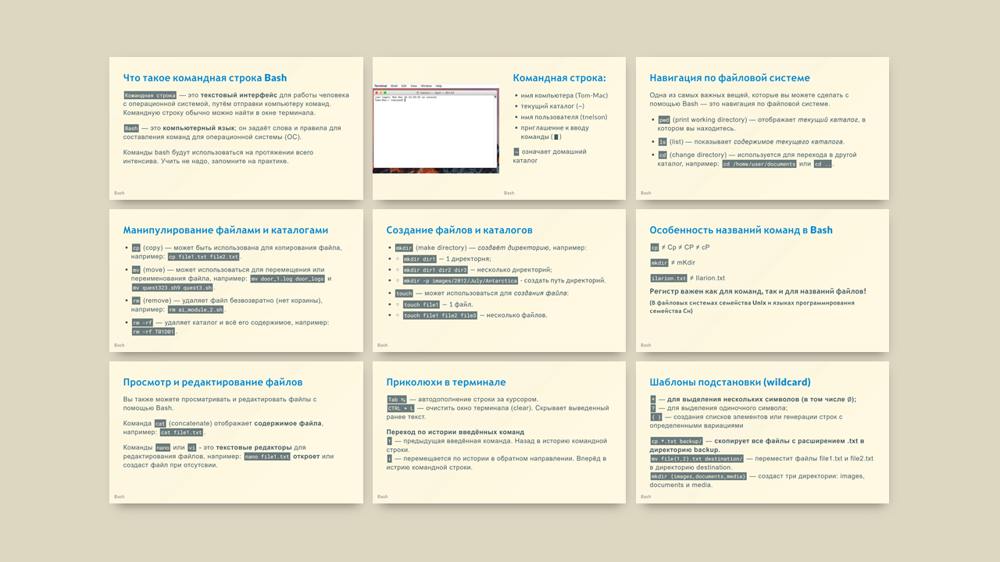
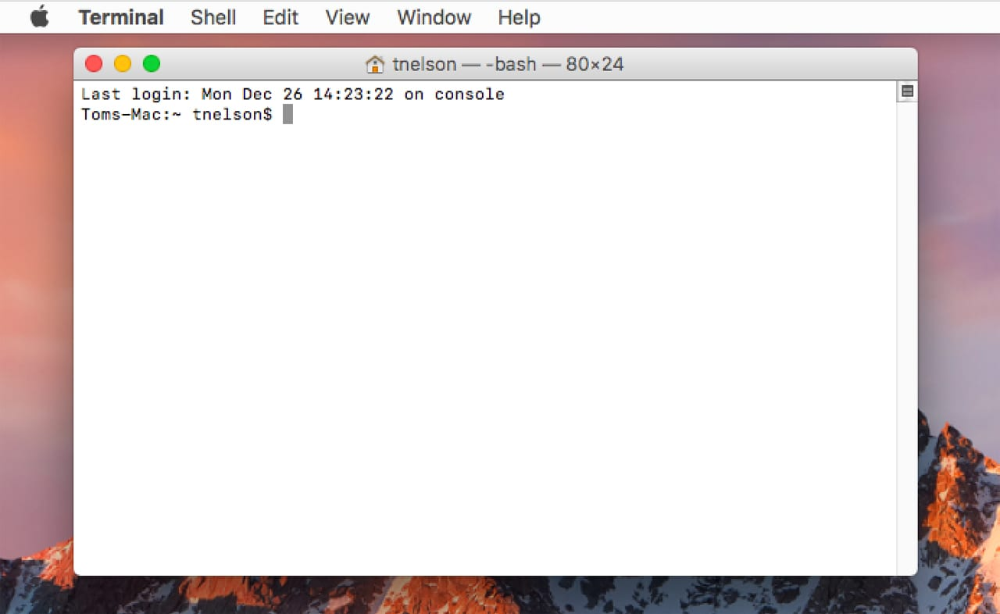
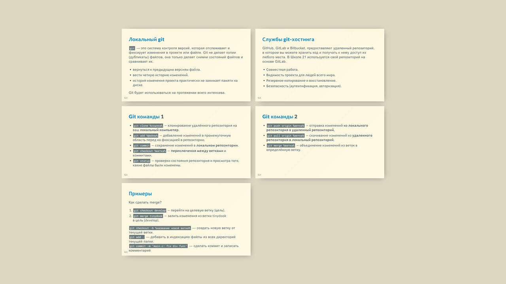
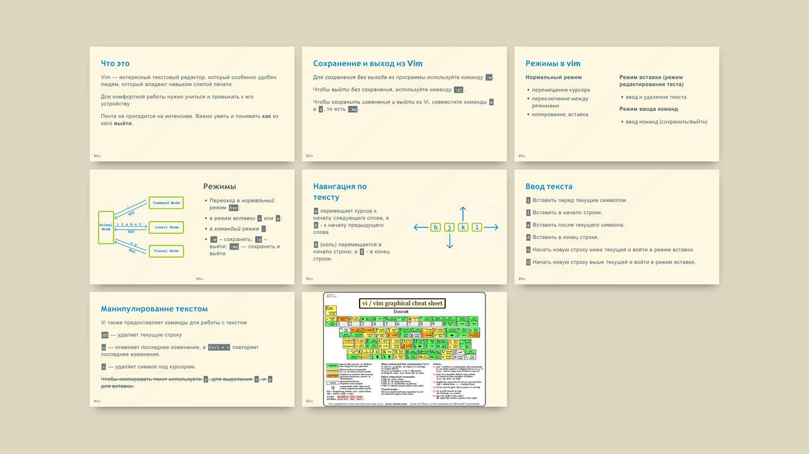
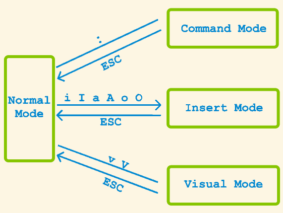
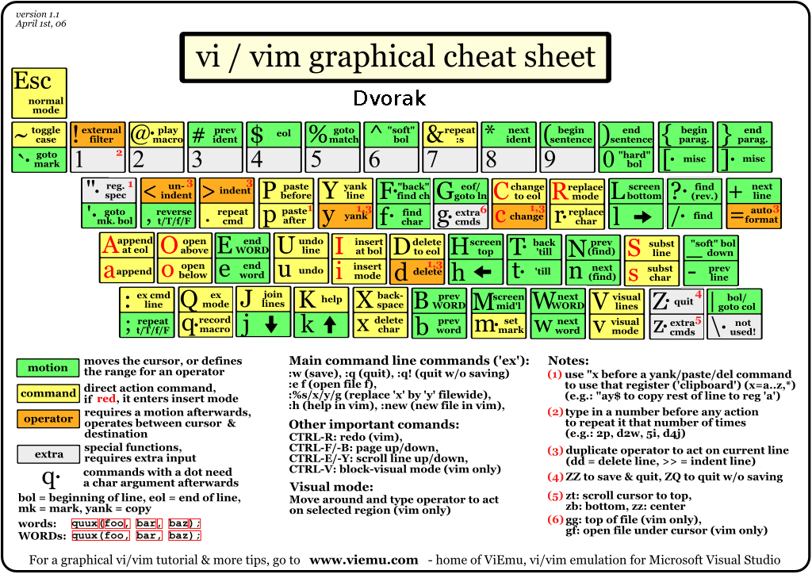

---

# **Командная**<!--fit-->
# строка       <!--fit-->
<!-- footer: "Bash" -->
<!-- _footer: "" -->

---

---

## **Что такое командная строка Bash**
`Командная строка` (оболочка) — это **текстовый интерфейс для работы человека с операционной системой**, путём отправки компьютеру команд. Командную строку обычно можно найти в окне терминала.

`Bash` — это **компьютерный язык**; он задаёт слова и правила для составления команд для операционной системы (ОС).

---

## **Командная строка:**
- имя компьютера (Tom-Mac)
- текущий каталог (~)
- имя пользователя (tnelson)
- приглашение к вводу команды (▮)

`~` означает домашний каталог

---

## **Навигация по файловой системе**
Одна из самых важных вещей, которые вы можете сделать с помощью Bash — это навигация по файловой системе.

- `pwd` (print working directory) — отображает _текущий каталог_, в котором вы находитесь.

- `ls` (list) — показывает _содержимое текущего каталога_.

- `cd` (change directory) — используется для перехода в другой каталог, например: `cd /home/user/documents` или `cd ..`.

---
## **Манипулирование файлами и каталогами**

- `cp` (copy) — может быть использована для копирования файла, например: `cp file1.txt file2.txt`.

- `mv` (move) — может использоваться для перемещения или переименования файла, например: `mv door_1.log door_logs` и `mv quest323.sh9 quest3.sh`.

- `rm` (remove) — удаляет файл безвозвратно (нет корзины), например: `rm ai_module_2.sh`.

- `rm -rf` — удаляет каталог и всё его содержимое, например: `rm -rf T01D01`.

---
## **Создание файлов и каталогов**

- `mkdir` (make directory) — _создаёт директорию_, например: 
- - `mkdir dir1` — 1 директория;
- - `mkdir dir1 dir2 dir3` — несколько директорий;
- - `mkdir -p images/2012/July/Antarctica` - создать путь директорий.

- `touch` — может использоваться для _создания файла_: 
- - `touch file1` — 1 файл.
- - `touch file1 file2 file3` — несколько файлов.

---

## **Особенность названий команд в Bash**

`cp` ≠ Cp ≠ CP ≠ cP

`mkdir` ≠ mKdir 

`ilarion.txt` ≠ Ilarion.txt

#### Регистр важен как для команд, так и для названий файлов!
###### (В файловых системах семейства Unix и языках программирования семейства Си)

---
## **Просмотр и редактирование файлов**
Вы также можете просматривать и редактировать файлы с помощью Bash.

Команда `cat` (concatenate) отображает **содержимое файла**, например: `cat file1.txt`.

Команды `nano` или `vi` - это **текстовые редакторы** для редактирования файлов, например: `nano file1.txt` **откроет** или создаст файл при отсутсвии.

---
## **Приколюхи в терминале**
`Tab ↹` — автодополнение строки за курсором.
`CTRL + L` — очистить окно терминала (clear). Скрывает выведенный ранее текст.

**Переход по истории введённых команд**
`🠕` — предыдущая введённая команда. Назад в историю командной строки.
`🠗` — перемещается по истории в обратном направлении. Вперёд в истрию командной строки.

---
## **Шаблоны подстановки (wildcard)**
`*`  — **для выделения нескольких символов (в том числе ∅);**
`?`  — для выделения одиночного символа;
`{ }`  — создания списков элементов или генерации строк с определенными вариациями

`cp *.txt backup/` — **скопирует все файлы с расширением .txt в директорию backup.**
`mv file{1,2}.txt destination/` — переместит файлы file1.txt и file2.txt в директорию destination.
`mkdir {images,documents,media}` — создаст три директории: images, documents и media.

---
# <!--fit-->**Git**
<!-- footer: "Git" -->
<!-- _footer: "" -->

---

---

## **Локальный git**
`git` — это система контроля версий, которая отслеживает и фиксирует изменения в проекте или файле. Git не делает копии (дубликаты) файлов, она только делает снимки состояний файлов и сравнивает их. 

- вернуться к предыдущим версиям файла.
- вести четкую историю изменений.
- история изменения проекта практически не занимает памяти на диске.

Git будет использоваться на протяжении всего интенсива. 

---

## **Службы git-хостинга** (удалённый git)

GitHub, GitLab и Bitbucket, предоставляют удаленный репозиторий, в котором вы можете хранить код и получать к нему доступ из любого места. В Школе 21 используется свой репозиторий на основе GitLab. 

- Совместная работа.
- Видимость проекта для людей всего мира.
- Резервное копирование и восстановление.
- Безопасность (аутентификация, авторизация).

---

## **Git команды** 1
- `git clone %ссылка%` — клонирование удалённого репозитория на ваш **локальный компьютер**.
- `git checkout %ветка%` — **переключения между ветками** и коммитами.
- `git add %файлы%` — добавление изменений в промежуточную область перед их фиксацией в репозитории.
- `git commit` — сохранение изменений в **локальном репозитории** (фиксация).
- `git status` — проверки состояния репозитория и просмотра того, какие файлы были изменены.

---

## **Git команды** 2
- `git push origin %ветка%` — отправка изменений **из локального репозитория в удаленный репозиторий**.
- `git pull origin %ветка%` — скачивание изменений из **удаленного репозитория в локальный репозиторий**.
- `git merge %ветка%` — объединение изменений из веток в определённую ветку. 

---
## **Примеры**
Как сделать merge?
1. `git checkout develop` — перейти на целевую ветку (цель).
2. `git merge tinydook` — залить изменения из ветки tinydook
в цель (develop).

`git checkout -b %название новой ветки%` — создать новую ветку от текущей ветки.
`git add .` — добавить в индексацию файлы из всех директорий текущей папки.
`git commit -m "main.c: fix div func"` — сделать коммит и записать комментарий

---

# <!--fit-->**Vi**m
<!-- footer: "**Vi**m" -->
<!-- _footer: "" -->
---

---

## **Что это**

Vim — интересный текстовый редактор, который особенно удобен людям, который владеют навыком слепой печати. 

Для комфортной работы нужно учиться и привыкать к его устройству

Почти не пригодится на интенсиве. Важно уметь и понимать **как** из него **выйти**.

---

## **Сохранение и выход из Vim**

Для _сохранения без выхода_ из программы используйте команду `:w`.

Чтобы _выйти без сохранения_, используйте команду `:q!`.

Чтобы _сохранить изменения и выйти_ из Vi, совместите команды `w` и `q`, то есть `:wq`.

---

## **Режимы в vim**

**Нормальный режим**
- перемещение курсора
- переключение между режимами
- копирование, вставка

**Режим вставки (режим редактирования теста)**
- ввод и удаление текста

**Режим ввода команд**
- ввод команд (сохранить/выйти)

---
## Режимы

- Переоход в _нормальный_ режим `Esc`;
- в режим _вставки_ `i` или `a`;
- в _командый_ режим `:`.

- `:w` – сохранить; `:q` – выйти; `:wq` — сохранить и выйти

---

## **Навигация по тексту**
`w` перемещает курсор к началу следующего слова, а `b` - к началу предыдущего слова

`0` (ноль) перемещается в начало строки, а `$` - в конец строки.

---
## **Ввод текста**

`i` Вставить перед текущим символом.

`I` Вставить в начало строки.

`a` Вставить после текущего символа.

`A` Вставить в конец строки.

`o` Начать новую строку ниже текущей и войти в режим вставки.

`O` Начать новую строку выше текущей и войти в режим вставки.

---

## **Манипулирование текстом**

Vi также предоставляет команды для работы с текстом

`dd` — удаляет текущую строку

`u` — отменяет последнее изменение, а `Ctrl + r` повторяет последнее изменение.

`x` — удаляет символ под курсором.

~~Чтобы скопировать текст используйте `y`, для выделения `v`, и `p` для вставки.~~

---

---

# <!--fit-->**Удачи!**
# Best of luck!

<!-- _footer: "morslomy / traviszh / wasprein" -->